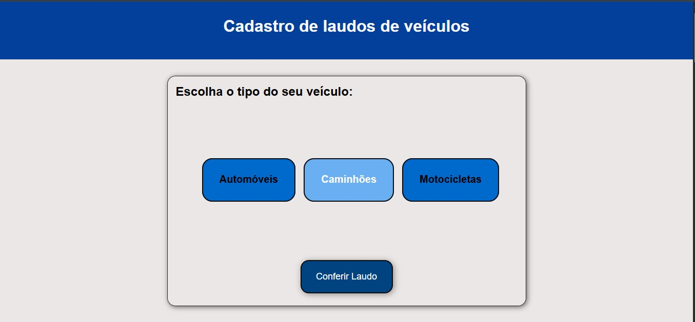
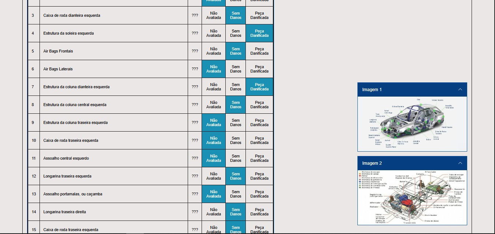
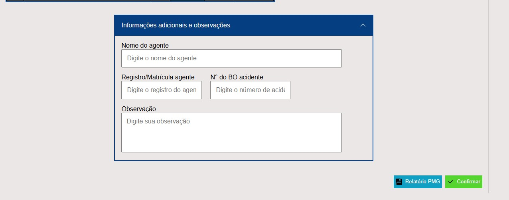
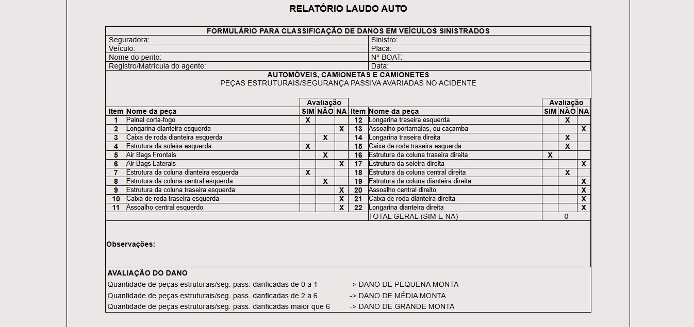

# 🚗 AutoLaudo (teste-siga) - v1.0.0

[](#)
[](#)
[](#)
[](#)
[](#)
[](#)
[](#)
[](#)

---

## 📖 Visão Geral

**AutoLaudo (teste-SIGA)** é um sistema web profissional concluído para avaliação, classificação e geração de laudos técnicos de danos em veículos sinistrados.  
O projeto permite registrar informações de veículos (automóveis, caminhões e motocicletas), capturar imagens, preencher formulários técnicos e gerar relatórios estruturados.

Diferenciais do projeto:

- Checklist de avaliação detalhado para cada tipo de veículo
- Laudos automáticos com classificação de danos
- Exportação de dados estruturados em JSON
- Interface responsiva adaptada para múltiplos dispositivos

---

## 🖥️ Requisitos de Sistema

- Node.js (versão recomendada ≥ 18)
- npm (gerenciador de pacotes)
- Navegador moderno (Chrome, Edge ou Firefox)

---

## ⚙️ Tecnologias Utilizadas

- Angular 15.2.0
- TypeScript 4.9.4
- RxJS 7.8.0
- HTML5 / CSS3
- Node.js e npm

---

## 💻 Instalação

1. Clone o repositório:

```bash
git clone https://github.com/seu-usuario/auto-laudo.git
cd auto-laudo
```

2. Instale as dependências:

```bash
npm install ou npm i
```

3. Rode o projeto:

```bash
ng serve ou npm run start
```

4.Acesse a aplicação em http://localhost:4200.

---

## 📂 Estrutura de Pastas

```text
src/
├── app/
│   ├── components/          # Componentes principais da aplicação
│   │   ├── register-form/   # Seleção e registro de veículos
│   │   ├── main-report/     # Relatório principal com imagens
│   │   ├── report-table/    # Tabela de classificação de danos
│   │   ├── report-form/     # Formulário adicional de informações
│   │   ├── table-checklist/ # Checklist interativo de avaliação
│   │   └── error-messages/  # Mensagens de validação e erros
│   ├── models/              # Interfaces TypeScript (VehicleInformation, VehicleImages etc)
│   └── app.component.ts     # Componente raiz da aplicação
├── assets/                  # Imagens, ícones e recursos estáticos
└── styles.css               # Estilos globais da aplicação
```

---

## 🧩 Componentes Principais

| Componente        | Função / Descrição                                                                                                                                         |
| ----------------- | ---------------------------------------------------------------------------------------------------------------------------------------------------------- |
| `register-form`   | 🚗 Interface para **seleção e registro do tipo de veículo** (automóvel, caminhão ou motocicleta). Permite adicionar informações básicas do veículo.        |
| `main-report`     | 📄 Exibe o **relatório principal** com imagens do veículo e informações detalhadas. Centraliza os dados para visualização e exportação.                    |
| `report-table`    | 📊 Tabela de **classificação de danos**, organizando cada item como Pequena, Média ou Grande Monta. Facilita a visualização dos danos por peça do veículo. |
| `report-form`     | 🖊️ **Formulário adicional** para dados do perito, matrícula, número de BO e observações técnicas. Permite registrar informações complementares ao laudo.   |
| `table-checklist` | 📝 **Checklist interativo** de itens estruturais e de segurança passiva do veículo. Permite marcar avaliações de forma intuitiva e visual.                 |
| `error-messages`  | ⚠️ Componente para **mensagens de validação e alertas** de preenchimento de formulários, garantindo que todos os dados obrigatórios sejam informados.      |

---

## 🔄 Fluxo de Funcionamento do Sistema

1. **Seleção do veículo** 🚗  
   O usuário escolhe o tipo de veículo (automóvel, caminhão ou motocicleta).

2. **Validação da seleção** ✅  
   O sistema verifica se o tipo de veículo é válido e carrega os dados correspondentes.

3. **Exibição do relatório inicial** 📄  
   Mostra imagens do veículo e informações básicas para análise.

4. **Preenchimento do checklist de avaliação** 📝  
   O usuário avalia danos estruturais e itens de segurança passiva do veículo.

5. **Formulário técnico adicional** 🖊️  
   Preenchimento de dados do perito, matrícula, número do BO e observações complementares.

6. **Geração do laudo final** 📊  
   O sistema organiza os dados e gera a classificação de danos: Pequena Monta, Média Monta ou Grande Monta.

7. **Exportação de dados em JSON** 💾  
   Todos os dados preenchidos podem ser exportados em **JSON estruturado** para registro, integração externa ou armazenamento.

---

## 📊 Modelos de Dados

```typescript
// VehicleInformation.ts
export interface VehicleInformation {
  numberId: number;
  pieceName: string;
  rating: "NA" | "SEM DANOS" | "DANIFICADA";
}

// VehicleImages.ts
export interface VehicleImages {
  url: string;
  alt: string;
}

// VehicleModelRating.ts
export interface VehicleModel {
  title: string;
  subtitle: string;
  ratings: VehicleRating;
}

//VehicleRating.ts
export interface VehicleRating {
  rating1: string;
  rating2: string;
  rating3: string;
}
```

---

## 📷 Demonstrações

<div align="center">
   
</div>

---

<div align="center">
   
</div>

---

<div align="center">
   
</div>

---

<div align="center">
   
</div>

---

<div align="center">
   <p>FEITO POR: ERICK CAMPOS</p>
</div>
